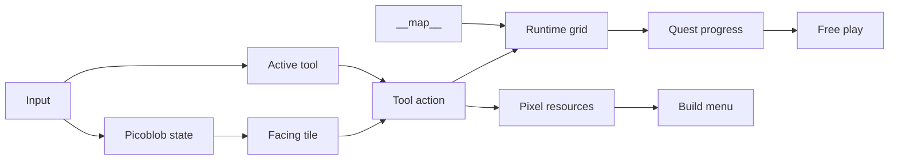

# Picopia Design Spec

## Summary

Picopia is a standalone PICO-8 cartridge about restoring a broken fantasy-console garden world. The implementation target is `picopia.p8`.

The current prototype is a compact top-down cozy sandbox. The player controls Picoblob, a tiny transformable blob who restores an abandoned 32x32 tile clearing with helper tools. The core loop is to clear bush, hydrate soil, grow flowers, earn pixels, complete quests, and use a build menu to place a tiny home.

## Design Pillars

Picopia should feel like a small fantasy-console restoration toy:

- Tools are learned as practical rebuilding actions.
- Each tool has a clear terrain purpose.
- Terrain changes form chains rather than isolated one-off actions.
- Restored land creates resources and future habitat opportunities.
- Building gives the restored land a visible purpose.
- The game continues after goals are complete.

## Tool Scope

Picopia intentionally keeps a small playable tool set. Not every possible rebuilding idea should become a tool, because PICO-8 readability and controller simplicity matter more than breadth.

Playable tools:

| Tool | Role | Current use | Upgrade direction |
| --- | --- | --- | --- |
| Chopbit | Clearing and gathering | Clears bush tiles into soil and grants pixels. | Cut from range or produce wood materials. |
| Watbit | Watering and hydration | Hydrates prepared dry soil into wet soil. | Water several tiles at once. |
| Sproutbit | Growth and habitat creation | Opens a grow menu on wet soil and grows grass, bushes, or flowers. | Grow habitat patches or visitor-attracting plant groups. |
| Smashbit | Stone and hard-material gathering | Breaks rock into soil and grants extra pixels. | Add stronger rocks or stone-specific materials. |
| Tillbit | Soil preparation | Tills grass or raw soil into prepared dry soil before watering. | Create farm plots or seed beds. |
| Build | Construction | Opens a build menu and places structures using pixels. | More buildings, decorations, and habitat pieces. |

Backlog policy:

- New tools beyond this set should only be added when they create new meaningful terrain relationships.
- The next improvements should upgrade existing tools before adding more tools.
- Traversal-only or cosmetic tools are out of scope for the current top-down 32x32 prototype.

## Current Direction

The approved version is a small but expandable restoration sandbox:

- One 32x32 world stored in PICO-8 `__map__`.
- A camera follows Picoblob around the larger map.
- Terrain tiles in the map use the same sprite ids that the editor shows.
- Tile `0` is reserved as empty; terrain starts at sprite id `1` so the editor does not show grass as black empty tiles.
- Tool use happens on the tile Picoblob is facing.
- Quest windows communicate goals outside the bottom HUD.
- Building uses a separate build tool and build menu.

## Core Concept

The game takes place in a neglected fantasy-console clearing after humans have vanished. Professor Sproutroot, a small mentor figure, asks Picoblob to restore the clearing.

Picoblob starts with three core helper tools:

- Chopbit clears old bushes.
- Watbit hydrates prepared dry ground.
- Sproutbit grows grass, bushes, or flowers from wet soil through a grow menu.
- Smashbit breaks rocks into useful soil/material pixels.
- Tillbit prepares grass or soil into dry soil for a new growth chain.

The key restoration chain is:

```text
bush -> soil -> dry soil -> wet soil -> flower
rock -> soil -> dry soil -> wet soil -> grass/bush/flower
grass -> dry soil -> wet soil -> grass/bush/flower
```

This makes the soil left behind by clearing bushes a useful normal stage instead of a dead-end sand tile.

## Controls

- D-pad: move Picoblob on the tile grid.
- Last movement direction becomes Picoblob's facing direction.
- 🅾️: cycle active tool in grow-loop order: Chopbit → Tillbit → Watbit → Sproutbit → Smashbit → Build.
- ❎: use the active tool.
- If the active tool is Build, ❎ opens the build menu.
- If the active tool is Sproutbit, ❎ opens the grow menu.
- In build/grow menus, ❎ confirms the selected item and 🅾️ closes the menu.
- 🅾️+❎ in normal play opens the current quest window.
- The start screen shows a drawn Picopia logo and explains all controls.
- Quest/help windows close with 🅾️ or ❎.

## Gameplay Rules

### Tile Types and Sprite IDs

Tile and sprite ids must match so PICO-8 editor view and runtime view are consistent:

- `0`: empty/reserved, not used for normal terrain.
- `1`: grass.
- `2`: bush blocker.
- `3`: dry soil.
- `4`: wet soil.
- `5`: flower.
- `6`: soil left by clearing bush.
- `7-8`: Picoblob animation sprites.
- `9`: Professor Sproutroot.
- `10-12`: helper/tool icons.
- `13`: tiny home/build icon.
- `14`: rock tile and Smashbit icon.
- `15`: Tillbit icon.
- `16`: bush grown by Sproutbit.

### Helper Transformations

The current chain should be:

- Chopbit acts on bush and changes it into soil.
- Watbit acts on prepared dry soil and changes it into wet soil.
- Sproutbit acts on wet soil by opening a grow menu; it can grow grass, bush, or flower.
- Smashbit acts on rock and changes it into soil.
- Tillbit acts on grass or raw soil and changes it into dry soil.

Invalid helper use leaves the tile unchanged and gives harmless feedback.

### Resources

Only meaningful harvesting and bloom actions grant pixels:

- Chopbit cutting bush: +1 px.
- Smashbit breaking rock: +1 px.
- Sproutbit growing flower: +1 px.
- Sproutbit growing grass or bush: no pixels.
- Watbit hydration: no pixels.
- Tillbit soil preparation: no pixels.

Pixels are spent in the build menu. Plant growth is free:

- Grass costs 0 px.
- Bush costs 0 px.
- Flower costs 0 px.
- Tiny home costs 30 px.

### Quests

Quest progress is communicated through pop-up quest windows rather than the bottom HUD.

Current quest flow:

1. Restore the garden: use all three helpers and grow at least 6 flowers.
2. Build a tiny home: select the Build tool, open the build menu, and spend 30 px.
3. Free play: all goals are complete, but the player can keep restoring terrain and exploring.

The game should not end or block play after all goals are complete.

## World Layout

The world is a 32x32 logical tile map using 8x8 tiles. It is stored in PICO-8 `__map__`, not a Lua table, so the map can be inspected and edited in the PICO-8 editor.

The reusable asset generator is `scripts/picopia_apply_assets.py`. It generates:

- `__gfx__` sprite sheet.
- `__map__` 32x32 gameplay map padded to PICO-8's 64 map rows.
- `__sfx__` sound effects.

The normal regeneration path is `scripts/picopia_apply_assets.py`. One-time migration scripts are not part of the long-term asset pipeline.

## Visual Style

Picopia should look like a PICO-8-native demake rather than a direct imitation of any specific external game.

Guidelines:

- Chunky 8x8 tiles.
- Bright limited palette.
- Readable silhouettes over detail.
- Picoblob as a small pink or purple blob with a simple wobble.
- Helpers represented through HUD/tool icons and action effects.
- Garden restoration shown through brighter greens, flowers, and sparkles.

## Feedback and Effects

Each tool should feel distinct:

- Chopbit: slash particles and cut SFX.
- Watbit: blue droplet particles and water SFX.
- Sproutbit: green sparkle or growth pop and growth SFX.
- Invalid action: small nope bounce and error SFX.
- Quest complete/build complete: celebratory SFX and sparkles.

## Technical Architecture

The implementation is a PICO-8 cartridge in `picopia.p8`.

Function groups:

- Lifecycle: `_init()`, `_update()`, `_draw()`.
- Input and movement: D-pad movement, facing direction, tool cycling, tool use.
- Tile world: `world_w=32`, `world_h=32`, `grid` loaded from `mget(x-1,y-1)`.
- Tool system: helper definitions with name, source tile, destination tile, color, pixel reward, and used flag.
- Quest system: garden quest, build quest, free-play state.
- Build system: build tool, build menu, building cost, placement validation.
- Rendering: camera, map tiles, Picoblob, Professor Sproutroot, house, HUD, build menu, quest/help windows, feedback effects.
- Assets: generated by `scripts/picopia_apply_assets.py` and verified by `scripts/pico8_verify_cart.py`.

## Data Flow



## Acceptance Criteria

- `picopia.p8` boots as a standalone PICO-8 cartridge.
- The world is 32x32 and loaded from `__map__`.
- The PICO-8 editor view and runtime view use matching tile ids.
- Tile `0` is reserved and normal terrain uses visible sprite ids.
- Picoblob can move around the map and camera follows.
- 🅾️ cycles tools.
- ❎ uses helper tools or opens the build menu when Build is selected.
- 🅾️+❎ opens the current quest window from normal play.
- Chopbit changes bush into soil.
- Watbit changes dry soil and soil into wet soil.
- Sproutbit opens a grow menu on wet soil and can grow grass, bush, or flower.
- Successful actions add pixels.
- The tiny home costs 30 px and is placed through the build menu.
- Quest windows show current/next goals.
- The game enters free play after all goals without ending or blocking input.
- Sound effects play for tool switching, success, error, quest completion, and building.
- `scripts/pico8_verify_cart.py picopia.p8` passes.

## Testing Plan

- Run `python3 scripts/pico8_verify_cart.py picopia.p8`.
- Regenerate assets with `python3 scripts/picopia_apply_assets.py picopia.p8` and verify again.
- Open the PICO-8 map editor and confirm grass is visible, not black tile `0`.
- Verify map tile ids correspond to runtime sprites.
- Walk around the 32x32 map and confirm camera bounds work.
- Use Chopbit on bush and confirm soil appears.
- Use Tillbit on soil and confirm dry soil appears.
- Use Watbit on dry soil and confirm wet soil appears.
- Use Watbit on raw soil and confirm it does not work before tilling.
- Use Sproutbit on wet soil and confirm the grow menu opens.
- Use the grow menu to grow grass, bush, and flower for 0 px.
- Confirm only flower growth grants 1 px; grass and bush growth grant no pixels.
- Confirm invalid actions do not corrupt the grid.
- Complete the garden quest and confirm the next quest window appears.
- Select Build, open the build menu, and place a tiny home after collecting 30 px.
- Confirm free play continues after the tiny home is built.

## Out of Scope for Current Prototype

- Full social simulation systems.
- Real-time clock or day-night cycle.
- Multiple biomes.
- Dialogue trees.
- Persistent save data.
- Full expanded tool set.
- Direct use of external character names, sprites, or copyrighted designs.

## Future Expansion Ideas

Expansion priority:

1. Watbit upgrade: water a small plus-shape or line instead of one tile.
2. Sproutbit upgrade: make 2x2 or 4-tile flower/grass patches attract visitors.
3. Chopbit upgrade: cut from range or produce wood-specific materials.
4. Smashbit upgrade: break stronger rock variants for more pixels.
5. Tillbit upgrade: create farm plots or seed beds.

Other future ideas:

- Visitors appear when specific micro-habitats are restored.
- Small logs that hint at the abandoned world.
- Decorative placement after the restoration goal.
- A tiny title screen and end card.
