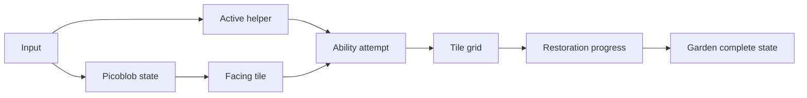

# Picopia Design Spec

## Summary

Picopia is a new standalone PICO-8 cartridge inspired by the cozy restoration fantasy of Pokémon Pokopia, translated into a legally distinct fantasy-console demake. The implementation target is `picopia.p8`. The existing `untitled.p8` cartridge remains unchanged.

The first prototype is a one-screen restoration puzzle. The player controls Picoblob, a tiny transformable blob who restores an abandoned 16x16 clearing with the help of three helper abilities: Sproutbit, Watbit, and Chopbit. The goal is to use all three helpers and restore enough messy terrain into a cozy garden.

## Source Inspiration

The design uses the supplied Pokopia context as inspiration, not as a direct adaptation:

- A transformable blob-like protagonist helps repair an abandoned world.
- Creature helpers teach or enable environmental actions.
- Restoration focuses on cultivating habitats, watering plants, cutting debris, and improving the world.
- The tone combines sandbox restoration, cozy creature companionship, and light post-human mystery.

Picopia reframes those ideas through PICO-8 constraints: one screen, 8x8 tiles, simple helper rules, tiny feedback effects, and playful fantasy-console naming.

## Approved Direction

The chosen direction is a compact one-screen restoration puzzle with cozy feedback.

Alternative directions considered:

- Habitat sandbox: closer to a social sim, but too broad for the first prototype.
- Story vignette: atmospheric, but less mechanically satisfying.
- Compact restoration puzzle: clear goals, readable mechanics, and strong fit for PICO-8.

The approved version uses the compact restoration puzzle as the core, with small lore and celebration touches for charm.

## Core Concept

The game takes place in a neglected fantasy-console clearing after humans have vanished. Professor Sproutroot, a small mentor figure, asks Picoblob to restore the clearing.

Picoblob uses three helpers:

- Sproutbit grows life from wet soil.
- Watbit waters dry soil.
- Chopbit clears brush.

The clearing starts messy. The player transforms terrain until the garden is restored. Completion happens when all helper abilities have been used at least once and enough tiles have become restored garden tiles.

## Controls

- D-pad: move Picoblob on the grid.
- Last movement direction becomes Picoblob's facing direction.
- Hold 🅾️ and press left/right: cycle active helper.
- Press ❎: use the active helper on the tile Picoblob is facing.

This avoids conflict between normal movement and helper selection.

## Gameplay Rules

### Tile Types

The first prototype should use a small logical tile set:

- Grass: restored ground.
- Flower: restored ground with extra visual reward.
- Brush: messy blocker that Chopbit can clear.
- Dry soil: target for Watbit.
- Wet soil: target for Sproutbit.
- Path or clear soil: walkable neutral tile.
- Optional rubble or edge decoration: non-core visual variety.

### Helper Transformations

- Chopbit acts on brush and changes it into clear soil.
- Watbit acts on dry soil and changes it into wet soil.
- Sproutbit acts on wet soil and changes it into grass or flower.

Invalid helper use leaves the tile unchanged and gives harmless feedback.

### Completion

The game tracks two requirements:

- Each helper has been used successfully at least once.
- At least 6 tiles have become restored tiles, meaning grass or flower.

When both requirements are satisfied, the game enters a completed state. The threshold is intentionally small so the prototype can be completed quickly while still requiring the full helper chain.

## One-Screen Layout

The world is a 16x16 logical grid using 8x8 tiles.

Recommended layout:

- HUD strip at the top or bottom with active helper and progress.
- Center clearing containing dry soil, wet soil, and brush.
- Brush clusters around the edges and a few inner blockers.
- Professor Sproutroot marker near a corner.
- Enough target tiles for all three helper abilities to be required.

The map should be readable at 128x128 resolution and should not require scrolling.

## Visual Style

Picopia should look like a PICO-8-native demake rather than a direct imitation.

Guidelines:

- Chunky 8x8 tiles.
- Bright limited palette.
- Readable silhouettes over detail.
- Picoblob as a small pink or purple blob with a simple wobble.
- Helpers represented primarily through HUD icons and action effects.
- Garden restoration shown through brighter greens, flowers, and sparkles.

## Feedback and Effects

Each helper should feel distinct:

- Chopbit: slash particles or a quick cutting flash.
- Watbit: blue droplet particles.
- Sproutbit: green sparkle or growth pop.
- Invalid action: small nope bounce, dull sound, or short text cue.
- Completion: restored tiles twinkle, HUD reads garden restored, and Professor Sproutroot displays a short success message.

## Technical Architecture

The implementation should be a fresh PICO-8 cartridge in `picopia.p8`.

Because the prototype is small, it can stay in one Lua section organized by function groups:

- Lifecycle: `_init()`, `_update()`, `_draw()`.
- Input and movement: D-pad movement, facing direction, helper cycling, ability use.
- Tile world: 16x16 table-backed grid and tile constants.
- Helper system: helper definitions with name, icon, valid source tile, result tile, used flag, and effect color.
- Progress system: restored tile count, used helper count, completion check.
- Rendering: tile grid, objects, Picoblob, HUD, feedback effects, and completion message.

## Data Flow

## Suggested Data Model

Use compact Lua tables and constants. The initial active helper should be Chopbit, because it can open blocked brush tiles at the start of the clearing.

Example structure for implementation planning:

- `tiles`: constants for grass, brush, dry soil, wet soil, flower, path.
- `grid`: 16 rows of 16 tile values.
- `player`: tile position, facing vector, animation timer.
- `helpers`: ordered list of Sproutbit, Watbit, Chopbit definitions.
- `active_helper`: index into `helpers`.
- `fx`: short-lived particles or feedback messages.
- `complete`: boolean completion state.

## Acceptance Criteria

- A new standalone cartridge file `picopia.p8` exists.
- `untitled.p8` remains unchanged.
- The initial active helper is Chopbit.
- The cart boots to a playable one-screen Picopia clearing.
- Picoblob can move around the grid and face the last movement direction.
- Holding 🅾️ plus left/right cycles the active helper between Sproutbit, Watbit, and Chopbit.
- Pressing ❎ uses the active helper on the tile Picoblob is facing.
- Chopbit changes brush into clear soil.
- Watbit changes dry soil into wet soil.
- Sproutbit changes wet soil into grass or flowers.
- Invalid helper use gives harmless feedback and leaves the tile unchanged.
- HUD shows active helper and restoration progress.
- Completion triggers after all three helpers have been used and at least 6 tiles are restored.
- Completion shows a garden restored message and celebration feedback.

## Testing Plan

- Start the cartridge and verify no runtime errors in `_init()`, `_update()`, and `_draw()`.
- Walk to each target tile type and verify the correct helper transforms it.
- Try wrong helper and wrong target combinations and verify they do not corrupt the grid.
- Cycle helpers repeatedly and verify helper state wraps correctly.
- Complete the restoration goal and verify completion only triggers after the helper and tile requirements are both met.

## Out of Scope for First Prototype

- Full social simulation systems.
- Real-time clock or day-night cycle.
- Multiple biomes.
- Creature dialogue trees.
- Crafting inventory.
- Persistent save data.
- Direct Pokémon names, sprites, or copyrighted character designs.

## Future Expansion Ideas

- Visitors appear when specific micro-habitats are restored.
- More helper abilities, such as smash, paint, light, or build.
- Small logs that hint at the abandoned world.
- Decorative placement after the restoration goal.
- A tiny title screen and end card.
