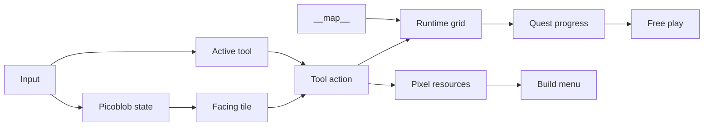

# Picopia Technical Architecture

## Cartridge

The implementation is a PICO-8 cartridge in `picopia.p8`.

## Function Groups

- Lifecycle: `_init()`, `_update()`, `_draw()`.
- Input and movement: D-pad movement, facing direction, tool cycling, tool use.
- Tile world: `world_w=32`, `world_h=32`, `grid` loaded from `mget(x-1,y-1)`.
- Tool system: helper definitions with name, source tile, destination tile, color, pixel reward, and used flag.
- Quest system: creature quest giver, garden quest, build quest, challenge flow, creature-center restoration goal, free-play state.
- Challenge system: objective cards, reward money/items/badges, environment-level gating.
- Badge system: milestone quest rewards that track notable restoration and creature achievements.
- Shop system: money spending, vegetable seeds, flower seeds, items, recipes, blueprints, environment-level stock unlocks.
- Inventory system: small item counters for food, seeds, badges, blueprints, and crafting ingredients.
- Energy system: action energy cost, hunger state, food-based recovery.
- Crafting system: craft menu, recipe costs, crafted-object placement, creature furniture, post-craft actions such as lighting a campfire.
- Creature system: creature state, feeding, home attraction, home assignment, living-condition level, ability unlocks, contextual helper actions.
- Farming system: tilled plots, vegetable seeds, flower seeds, crop growth, moisture hints.
- Build system: build tool, build menu, building cost, blueprint requirements, creature-helper requirements, placement validation.
- Rendering: camera, map tiles, Picoblob, Professor Sproutroot, house, HUD, build menu, quest/help windows, feedback effects.
- Assets: generated by `scripts/picopia_apply_assets.py` and verified by `scripts/pico8_verify_cart.py`.

## Data Flow



## Asset Pipeline

The reusable asset generator is `scripts/picopia_apply_assets.py`.

It generates:

- `__gfx__` sprite sheet.
- `__map__` 32x32 gameplay map padded to PICO-8's 64 map rows.
- `__sfx__` sound effects.

The normal regeneration path is `scripts/picopia_apply_assets.py`. One-time migration scripts are not part of the long-term asset pipeline.

## Verification

The cartridge should be verified with:

```sh
python3 scripts/pico8_verify_cart.py picopia.p8
```

After asset regeneration, verify again:

```sh
python3 scripts/picopia_apply_assets.py picopia.p8
python3 scripts/pico8_verify_cart.py picopia.p8
```
